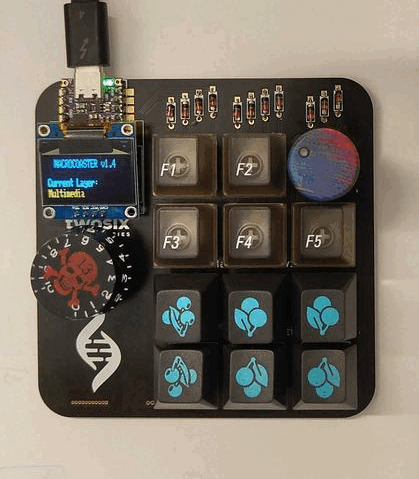
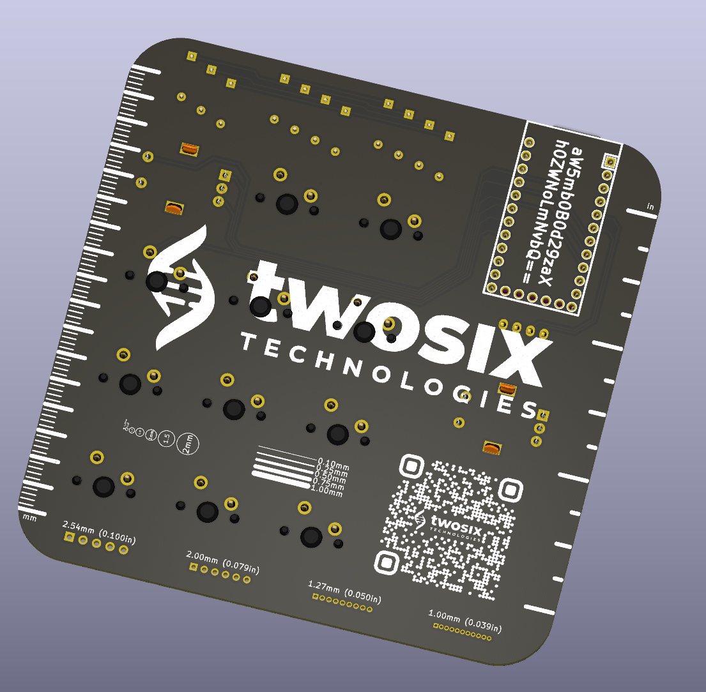
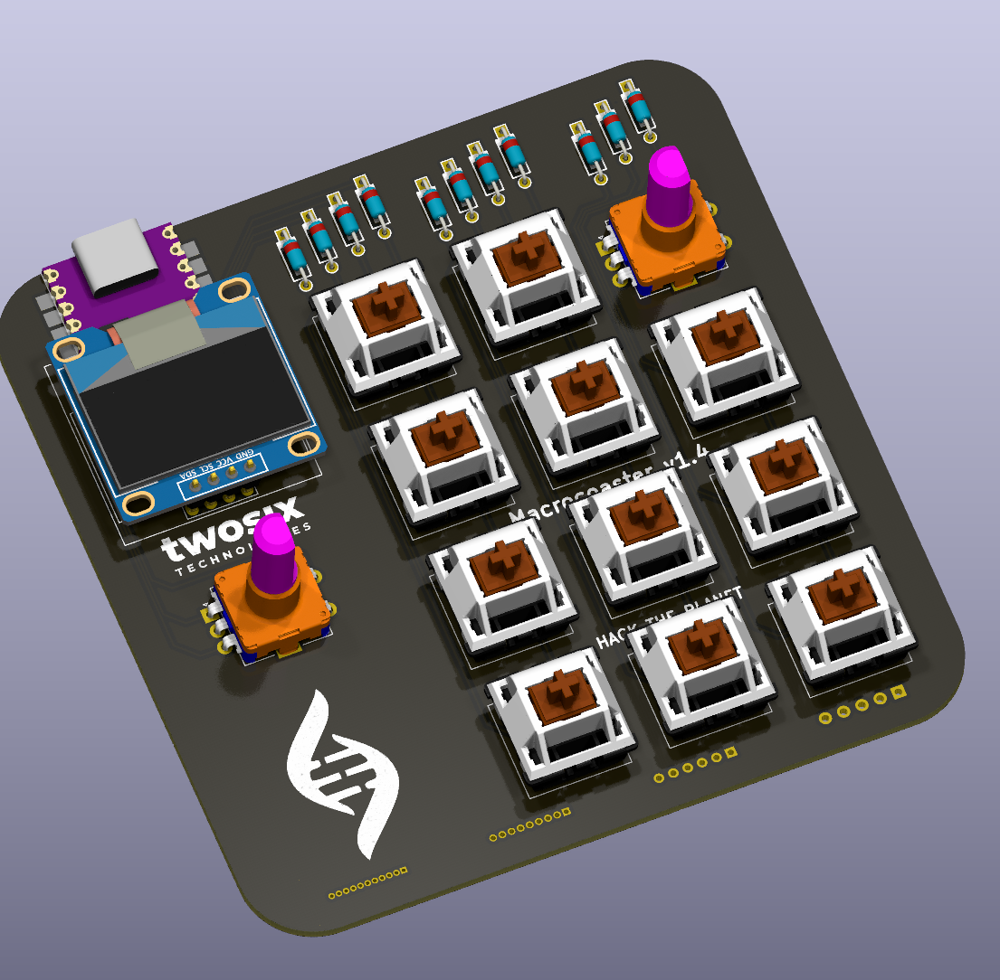
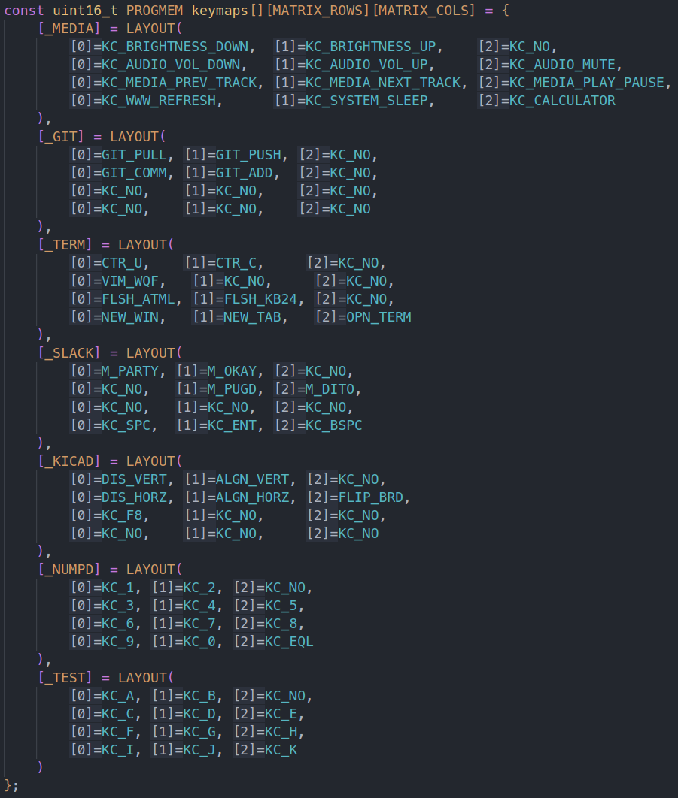

# Macrocoaster

Thank you for picking up a macrocoaster from TwoSix Technologies!



If you weren't able to pick one up in person, [this repo](./hardware/PCB/) contains mainufacturing files to order your own board (through JLCPCB, PCBWAY, etc.)

## Why this?
We wanted to give you something useful, fun, and memorable, whether it's a neat circuit board coaster, a fun beginner-friendly soldering kit, or a powerful productivity tool :)


## Usage
The Macrocoaster has two main uses: as a coaster, and as a macropad!
### Coaster:


* Coaster 👍
### Macropad:
 


* A "macropad" is a (usually) small keyboard used to add functionality to or automate your regular keyboard. Each key's function is programmable, so on a press it can type entire paragraphs, change your computer volume, or hit a combination of keys together. 

* The macrocoaster is unique in that there is a knob that lets you scroll through [layers](https://keebmaker.com/pages/layers), allowing for "pages" of macro keys, instead of just 11. You can think of this like how your SHIFT key changes certain keyboard keys to something else, but instead of one modifier key (SHIFT), you have a dial!

## Feature Overview
### Hardware
* Ruler
    * Inch and mm ruler
    * Common trace widths
    * Common hole diameters
* Header references
    * Common header pitches for reference
* Cross-microcontroller compatibility
    * The macrocoaster board can use an [Arduino Pro Micro](https://www.aliexpress.us/item/3256805735375493.html), [Elite-C](https://www.boardsource.xyz/products/Elite-C_v4), [kb2040](https://www.adafruit.com/product/5302) or any other pro-micro-esque footprint board [supported by QMK](https://github.com/qmk/qmk_firmware/blob/master/docs/compatible_microcontrollers.md)
* ENIG finish - there's gold on this board! 😱
### Software
* Scrollable layers
    * The left rotary encoder scrolls through defined keyboard layers (displayed on the OLED) for a theoretical maximum of (32 layers) * (11 keys) = *_352_ custom macro keys*!
* Bindable rotary encoder
    * By default, the right rotary encoder functions as a volume knob, but can be rebound to send any keycode! (for example, scrolling the grid size in KiCAD)
* Caps-lock indicator via OLED

## BoM (Bill of Materials)
See the [interactive BoM](https://htmlpreview.github.io/?https://github.com/Engineer-26/macrocoaster/blob/main/hardware/BoM/ibom.html) :)
<!-- Note: Update link to future repo! -->

#### Required:
* Microcontroller (see [above](#hardware))
* Any full-size [Cherry MX](https://www.keychron.com/blogs/news/cherry-mechanical-switch-guide) style [keyswitches](https://www.theremingoat.com/blog/beginners-guide) work 
    * Personally, [these](https://drop.com/buy/everglide-oreo-mechanical-switches) and [these](https://divinikey.com/products/lelelab-y2k-tactile-switches) are my favorite
* I recommend [EC-11 style rotary encoders](https://www.amazon.com/uxcell-Degree-Encoder-Digital-Potentiometer/dp/B07R8JPM6D)
* I used [these diodes](https://www.amazon.com/BOJACK-Switching-IN4148-Electronic-Silicon/dp/B07Q4F3Y5W)
* Any 128x64 `SSD1306` OLED breakout with a `[GND, Vcc, SCL, SDA]` pinout works
    * I used [these](https://www.amazon.com/Hosyond-Display-Self-Luminous-Compatible-Raspberry/dp/B09C5K91H7) as the yellow lines make the layer name stand out nicely :D

#### Optional: (but highly recommended)
* Keycaps
    * Entirely your preference :)
        * [This site](https://kbdfans.com/collections/keycaps) is a great starting point
            * Check if there is a "numpad" set, if you don't want the whole keyboard
            * Sites such as [this](https://www.wasdkeyboards.com/products/keycaps/blank-keycap-singles.html) offer per-key pricing, some other sites can even print custom designs on keys!
* Rotary encoder knobs
    * There are many, many [options](https://www.amazon.com/s?k=potentiometer+knob), just make sure they fit your encoder shaft (some are semi-circles, some have knurling, etc.)
* [Rubber "feet"](https://www.amazon.com/s?k=rubber+feet)
    * This keeps the bottom of the board (with the solder blobs/THT components) from scratching up or shorting on whatever surface you have.

## Assembly
1. Liberally apply flux to the back of the board (the side with all the graphics)
2. Place your key switches (`SW1` - `SW11`) in (on the side without the rules), and solder them
3. Diodes (technically optional, if you don't care about [ghosting](https://pcbheaven.com/wikipages/How_Key_Matrices_Works/))
    * If using diodes, solder down `D1` - `D11` (in any order). Make sure the polarity is correct.
    * If not using diodes, short `D1` - `D11` with solder, wires, or leads
4. Solder both rotary encoders (`SW13`, `SW14`)
5. Solder down your controller
    * You can use the castellated pads if your controller has them, or simply use traditional headers
6. Head down to the [Programming guide](#programming) before soldering the OLED
7. Apply some kapton (or other non-conductive tape) to the bottom of the OLED
    * This prevents the OLED from shorting microcontroller pins
8. Solder down the OLED so it covers your controller
    * Note: if using headers (instead of castellated pads) to solder down your controller, you made need [tall headers](https://www.amazon.com/HiLetgo-20pcs-2-54mm-Single-Header/dp/B07R5QDL8D) or [female headers](https://www.amazon.com/Glarks-Connector-Assortment-Stackable-Breakaway/dp/B07CWSXY7P) to clear the board.
        * In the case of the kb2040, the stemma connector causes the OLED to sit at a bit of an angle, which personally I find kind of convenient.

## Programming
1. Install `qmk`
    * [QMK install guide](https://docs.qmk.fm/#/newbs_building_firmware)
        * Note: Merging the macrocoaster into qmk is underway, for now you'll need to define a new keyboard (`qmk new-keyboard`).
2. Download the code
    * `git clone https://github.com/twosixtech/macrocoaster && cd macrocoaster/firmware`
3. Compile and flash for your microcontroller
    * You will need to press the Flash/boot/etc. button down when loading the code for the first time (QMK will prompt you ) 
        * All later flashes can be done with the [magic-bootloader](https://github.com/qmk/qmk_firmware/blob/master/docs/feature_bootmagic.md) key :)
    * Elite-C/Pro-micro
        * `qmk compile -kb macrocoaster -km default && qmk flash -bl dfu -km default -kb macrocoaster`
    * kb2040
        * `qmk compile -kb macrocoaster -km default && qmk flash -km default -kb macrocoaster -e CONVERT_TO=kb2040`

## Macropad Usage
By default, the macropad comes with (roughly) [this layout](./firmware/keymaps/default/keymap.c):



## Customization (WIP)
Almost all customization will be done in the [`keymap.c`](./firmware/keymaps/default/keymap.c) file.

See the [QMK docs](https://docs.qmk.fm/#/) and [QMK code](https://github.com/qmk/qmk_firmware/blob/master/docs/) for instructions/guidance, as well as the comments in `keymap.c`.
* If you toss the code, with its existing comments into ChatGPT, it does a pretty good job at helping explain :)

The bootloader can be entered by holding down the `SW4` key while the board is powered on
* Note: with the `kb2040`, entering the bootloader make take a few attempts (make sure to wait ~5s on each attempt)

_Note_: Unfortunately because of QMK is architected with macros and `#define`'s, values for things like layer #'s must be known at compile-time and not runtime, making things like automatically calculating the next/prev layer very difficult :(
For example, 
```
#define NUMBER_OF_LAYERS (sizeof(keymaps) / sizeof(keymaps[0]))

int get_next_layer(int currlayer) {
    return (currlayer + 1) % NUMBER_OF_LAYERS;
}
int get_prev_layer(int currlayer) {
    return (currlayer - 1 + NUMBER_OF_LAYERS) % NUMBER_OF_LAYERS;
}
```
is not possible. </a>

<!-- ## Cases (WIP)
STL/3MF files for 3D-printable cases can be found here:
* [Nothing yet](link.needed) -->