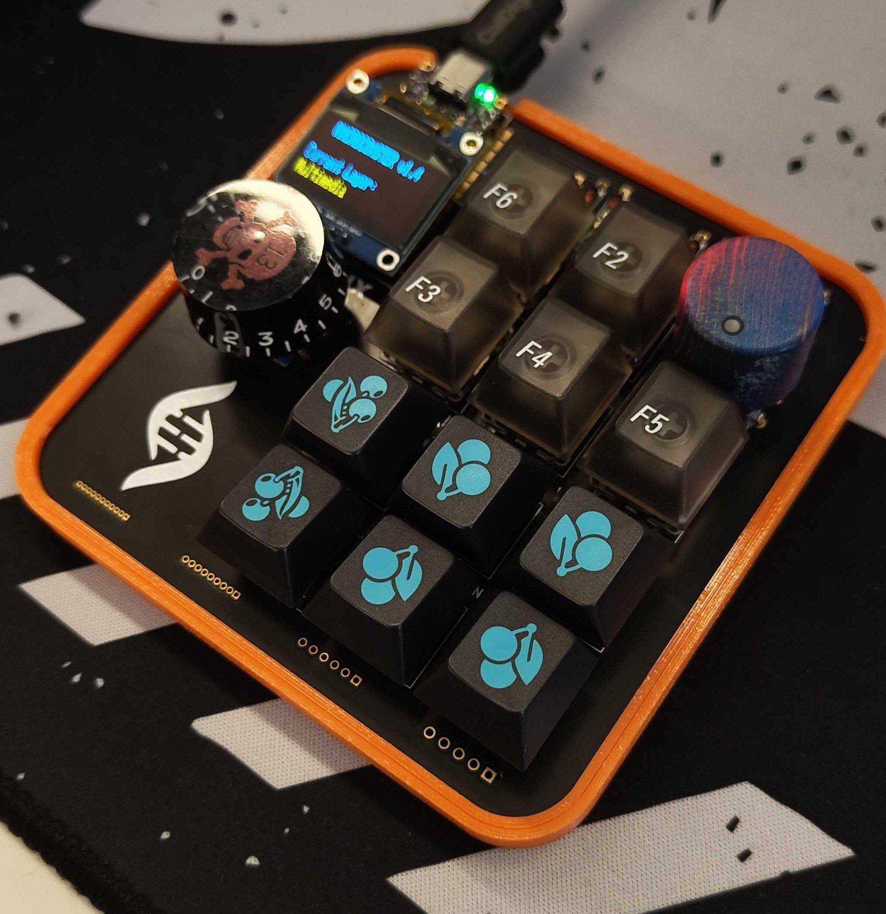
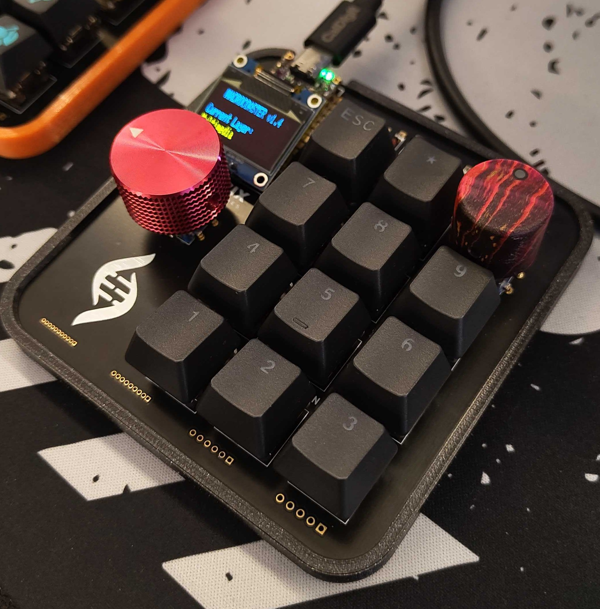
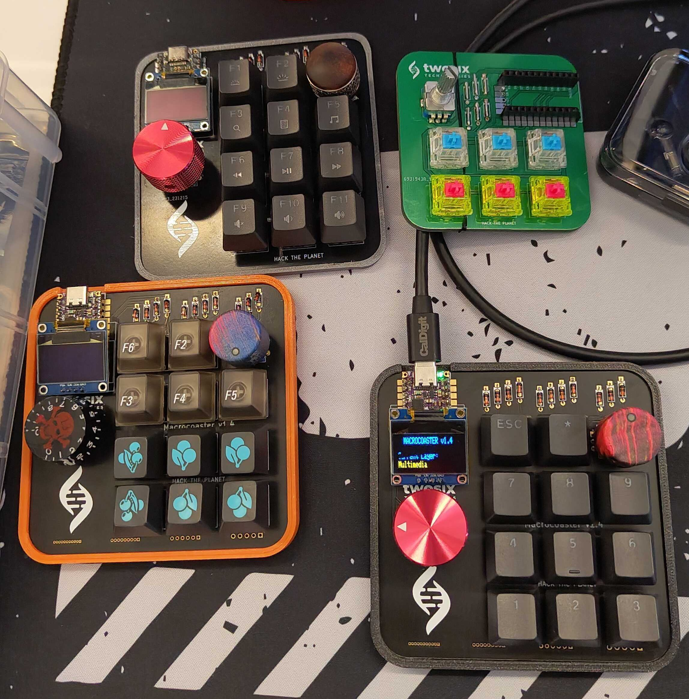

## My Macrocoaster Build

### Info
Hey all! These are my personal macrocoasters I use :)

### BoM
I use both an elite-c and kb2040 based macrocoaster, with the BoM described in the main README.md hahaha

### Pics
  

I primarily use my kb2040 based board, but keep an  elite-c based one on my desk as well to make sure the firmware works on both!

The kb2040 based one has the skull guitar knob on it, as features the case printed in TPU (a semi-flexible filament) which helps insulate the board and sounds nice :)

The Elite-C based one has the frame printed in PLA for simplicity.

If anyone is curious, there were several dev board versions, this is the whole family:

### Customizations/changes
Running stock firmware and hardware ;)